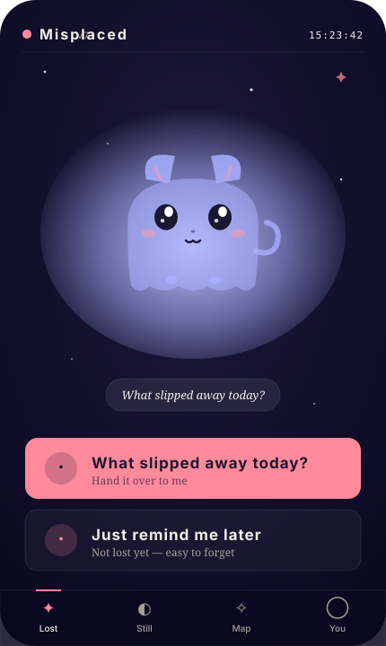
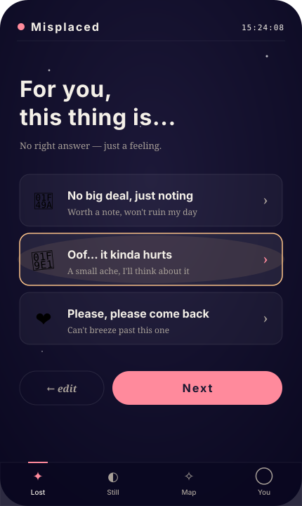
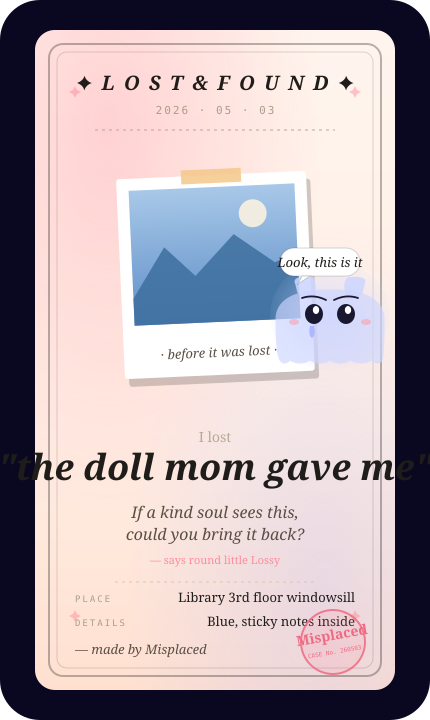
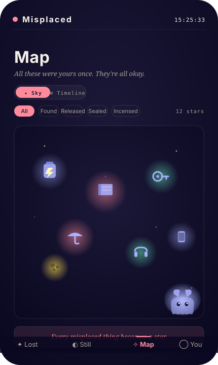

<div align="center">



<br>

# Misplaced

**Park what's hanging in your head, take a breath.**

*A light, healing tool for people who misplace things.*

[](https://github.com/wangranm-a11y/misplaced/actions/workflows/lint.yml)
[](https://wangranm-a11y.github.io/misplaced/)
[](https://wangranm-a11y.github.io/misplaced/)
[](#license)
[](#)
[](https://github.com/wangranm-a11y/wodiu)

[**🌐 Try it live**](https://wangranm-a11y.github.io/misplaced/) · [Why](#-why-this-exists) · [Stack](#-stack) · [Run locally](#-run-locally)

</div>

---

## ✨ Why this exists

> I'm someone who loses things constantly. Recently I lost a French textbook. Before that, a stuffed animal I really loved.
>
> The worst part of losing things, for me, was never the thing itself — it was the string in my head, always tense.
>
> Turns out there's a name for this: the **Zeigarnik Effect**. Unfinished tasks keep occupying our cognitive resources. But the moment you "write them down", your brain decides "someone's handling it" — and you're free to think about something else.
>
> That's where Misplaced came from.
>
> It doesn't help you find anything. It doesn't pretend nothing happened. It just takes the thing hanging in your head — and says: *"Logged. Go on."*

The whole thing centers on a tiny ghost cat named **Lossy** — main visual, companion, container for things that were temporarily lost.

---

## 📱 Preview

<table>
<tr>
<td></td>
<td></td>
<td></td>
<td></td>
</tr>
<tr align="center">
<td><b>Hero · Lossy</b><br><sub>back → turn → lick</sub></td>
<td><b>Weight</b><br><sub>💚 🧡 ❤️ three taps</sub></td>
<td><b>Lost Poster</b><br><sub>Lossy + photo + plea</sub></td>
<td><b>Star Map</b><br><sub>resolved items ✦</sub></td>
</tr>
</table>

---

## 🌟 Features

| Module | What it does |
|---|---|
| **Lost** | Weight loss → search / release / heal three paths |
| **Still Out There** | Combined "remind me" + "still searching" — anything pending |
| **Star Map** | Resolved items as a **starfield ✦** + **timeline ≡** dual view |
| **Cyber Incense** 🕯 | Press-and-hold 3s → ember + smoke + bowl chime, a digital farewell ritual. Now offered after **every** release, not just heavy ones |
| **Lost Poster** | Canvas-rendered shareable poster with mascot + optional photo |
| **Next Chapter** | AI weaves a personified fantasy of where the item went after leaving you |
| **Background music** 🎵 | Three synthesized ambient themes: ☀ Warm (F-major) / ☾ Moonlight (D-dorian) / ≋ Sea breeze (A-pentatonic + waves) |
| **About Misplaced** | The Zeigarnik Effect & the story behind it |

---

## 🎨 Design

Tone: **"Soft Night"**

- Deep indigo `#0a0820` + scattered stars + frosted glass cards
- Single warm accent `#ff8a9c` coral pink (only on primary CTAs)
- Lavender aura `#a8b0ff` only around Lossy
- Three weight tiers: 💚 `#5fd9b0` / 🧡 `#ffc58a` / ❤️ `#ff8a9c`

Typography (loaded from CDNs):
- **Smiley Sans** for headlines
- **LXGW Wenkai Screen** for soft body
- **JetBrains Mono** for time / labels

---

## 🛠 Stack

Zero build, zero dependencies, pure static:

```
HTML  · single page + PWA manifest + Service Worker
CSS   · CSS variables + glassmorphism + custom animations
JS    · vanilla ES6, no framework
Canvas 2D       — Lost Poster generation
Web Audio API   — sound effects + 3-theme ambient music synthesis
Vibration API   — haptic feedback
SVG inline      — Lossy mascot + star map item icons
localStorage    — local-only data (no backend)
pollinations.ai — AI text + illustration (anonymous, falls back to local)
```

---

## 🚀 Run locally

```bash
git clone https://github.com/wangranm-a11y/misplaced.git
cd misplaced
python3 -m http.server 8765
# Visit http://localhost:8765/index.html
```

No `npm install`, no build step. Just static files.

---

## 📲 Install as PWA

Open [wangranm-a11y.github.io/misplaced](https://wangranm-a11y.github.io/misplaced/) on mobile:

- **iOS Safari**: Share → Add to Home Screen
- **Android Chrome**: Menu → Install app

After installing, you get an offline-capable app icon, system notifications, vibration, and one-tap sharing for Lost Posters.

---

## 🧪 Notes

- All data lives in `localStorage` (no sync across devices yet — V2 will add auth)
- AI illustration uses [pollinations.ai](https://pollinations.ai) — anonymous and free, but flaky. 14s timeout falls back to a hand-tuned SVG watercolor scene
- Notifications / vibration / music all require a first user gesture (browser policy)
- Service Worker caches all static assets — bump cache version on update to refresh

---

## 📂 File layout

```
misplaced/
├── index.html             — single-page entry
├── styles.css             — all styles
├── app.js                 — main logic
├── mascot.js              — Lossy SVG generator (chibi ghost cat)
├── icons.js               — auto-match item type to cartoon icon
├── sounds.js              — Web Audio sound effects + ambient music
├── findcard.js            — Lost Poster Canvas renderer
├── incense.js             — Cyber Incense interaction
├── starmap.js             — starfield view rendering
├── ai.js                  — pollinations.ai calls + local fallback
├── copy.js                — all rotating copy (6-10 lines per scene)
├── manifest.json          — PWA manifest
├── sw.js                  — Service Worker
├── icons/                 — App icons (192/512)
├── assets/
│   ├── og-image.svg       — social share card (1200×630)
│   └── preview/           — README preview shots
└── .github/workflows/
    └── lint.yml           — CI: JS syntax + asset paths + manifest
```

---

## 🔮 Roadmap

- [ ] Account system + cloud sync
- [ ] Lossy growth system (unlockable looks)
- [ ] Year-end recap (long-form image)
- [ ] AI-generated cartoon illustrations (V2)
- [ ] Desktop widget
- [ ] More music themes

---

## 🌏 Other languages

- 🇨🇳 **中文版「我丢」** → https://github.com/wangranm-a11y/wodiu

---

## License

MIT © wangranm-a11y · 2026

<div align="center">

<sub>Here when you need it ✦</sub>

</div>
